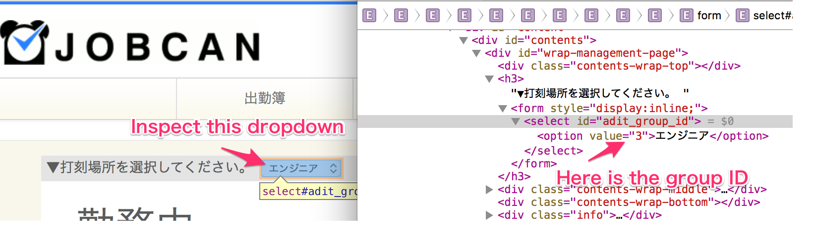

# Ruboty::Jobcan

## Usage
### When you have the code
`<code>` is the text attached to your mobile login URL,
e.g. `http://jobcan.jp/m?code=YOUR_CODE_GOES_HERE`.
Check out the invitation mail from JOBCAN for the URL.

```
# Set up
ruboty remember my jobcan code <code>
ruboty remember my jobcan group id <group_id>
```

### When you have client id, email and password
First, you should set env.

```
RUBOTY_JOBCAN_CLIENT_ID
RUBOTY_JOBCAN_EMAIL
RUBOTY_JOBCAN_PASSWORD
```

And, set your default group id.
```
# Set up
ruboty remember my jobcan group id <group_id>
```

```
# Clock in/out with default group id
ruboty punch the clock
ruboty punch in
ruboty punch out
```

`<group_id>` is the numeric ID of your group;
ask your manager or check out the source code of https://ssl.jobcan.jp/employee for it.



If you want to use different group id, you can use that.
```
# register group id alias
ruboty register my jobcan group alias <group_name> -> <group_id>

# Clock in/out with group alias
ruboty punch the clock at <group_name>
ruboty punch in at <group_name>
ruboty punch out at <group_name>
```


## Installation


```ruby
gem 'ruboty-jobcan'
```

And then execute:

    $ bundle

Or install it yourself as:

    $ gem install ruboty-jobcan

## Development

After checking out the repo, run `bin/setup` to install dependencies. Then, run `rake false` to run the tests. You can also run `bin/console` for an interactive prompt that will allow you to experiment.

To install this gem onto your local machine, run `bundle exec rake install`. To release a new version, update the version number in `version.rb`, and then run `bundle exec rake release`, which will create a git tag for the version, push git commits and tags, and push the `.gem` file to [rubygems.org](https://rubygems.org).

## Contributing

Bug reports and pull requests are welcome on GitHub at https://github.com/uasi/ruboty-jobcan.

